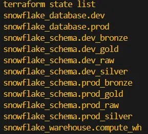
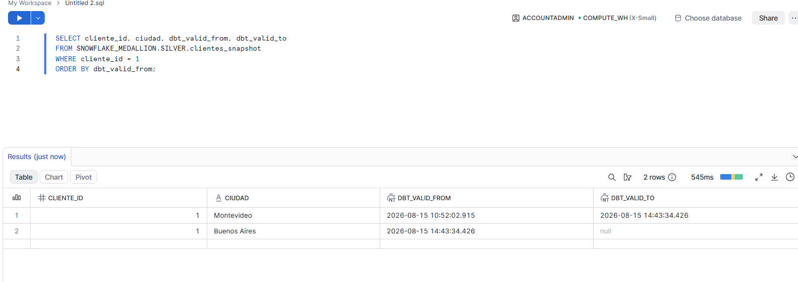
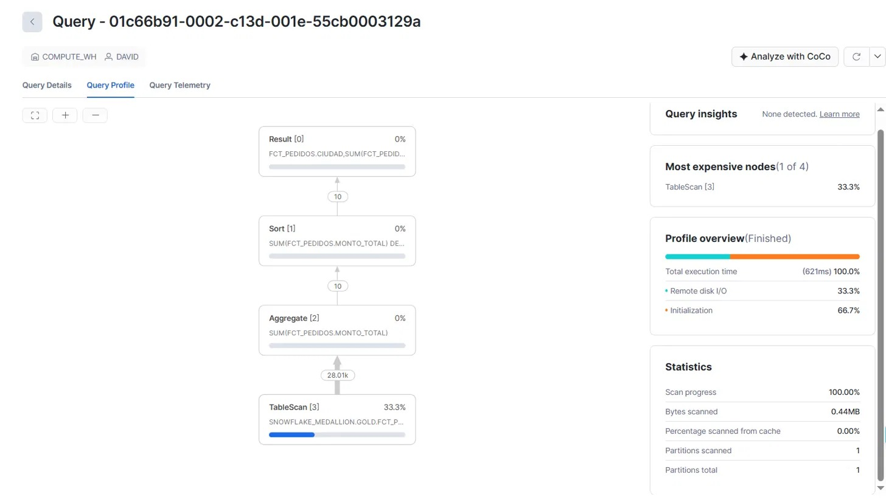
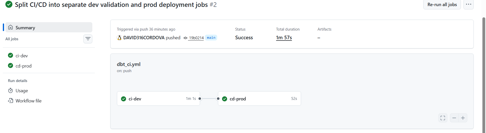

# Snowflake Medallion Architecture — dbt, Terraform, Airflow, CI/CD

A hands-on data engineering project implementing a full **medallion architecture**
(Bronze → Silver → Gold) on **Snowflake**, orchestrated with **Airflow**, provisioned
with **Terraform**, transformed with **dbt**, and deployed through **CI/CD** with
GitHub Actions.

The goal of this project is to practice, end-to-end, the core skills a modern data
engineer needs on the Snowflake + dbt stack: infrastructure as code, layered data
modeling, testing, semi-structured data handling, change data capture, incremental
loading, historical tracking, orchestration, and continuous deployment across
isolated dev/prod environments.

---

## Architecture overview

```
                         ┌─────────────────────────────┐
                         │         TERRAFORM           │
                         │  Manages infrastructure:    │
                         │  warehouse, databases,      │
                         │  schemas (dev & prod)       │
                         └──────────────┬───────────────┘
                                        │
              ┌─────────────────────────┴─────────────────────────┐
              │                                                     │
   ┌──────────▼──────────┐                              ┌──────────▼──────────┐
   │  SNOWFLAKE_MEDALLION │  (dev)                       │ SNOWFLAKE_MEDALLION  │  (prod)
   │                      │                              │        _PROD         │
   │  RAW → BRONZE →      │                              │  RAW → BRONZE →       │
   │  SILVER → GOLD       │                              │  SILVER → GOLD        │
   └──────────────────────┘                              └───────────────────────┘

   Python scripts insert dirty, realistic data into RAW (simulating a messy
   upstream source system), and optionally load files through Snowpipe.

              │
              ▼
   ┌────────────────────────────────────────────────────────────┐
   │                          dbt                                │
   │  bronze/  →  type casting only, no dedup, no business rules │
   │  silver/  →  dedup, business rules, VARIANT parsing, tests  │
   │  gold/    →  dimensional model, aggregates                  │
   │  snapshots/ → SCD Type 2 history tracking                   │
   └────────────────────────────────────────────────────────────┘
              │
              ▼
   ┌────────────────────────────────────────────────────────────┐
   │                        AIRFLOW                              │
   │  DAG: generate data → dbt run → dbt test → dbt snapshot     │
   │  Runs in Docker, scheduled daily, with automatic retries    │
   └────────────────────────────────────────────────────────────┘

   ┌────────────────────────────────────────────────────────────┐
   │                    GITHUB ACTIONS (CI/CD)                   │
   │  ci-dev  → validates every push/PR against the dev target   │
   │  cd-prod → deploys to prod, only after ci-dev succeeds and  │
   │            only on a direct push to main                    │
   └────────────────────────────────────────────────────────────┘
```

---

## Tech stack

| Layer | Tool |
|---|---|
| Data warehouse | Snowflake |
| Infrastructure as Code | Terraform (`snowflakedb/snowflake` provider) |
| Transformation | dbt-core + dbt-snowflake |
| Orchestration | Apache Airflow (Docker, LocalExecutor) |
| CI/CD | GitHub Actions |
| Data generation | Python (`snowflake-connector-python`) |
| Testing | dbt native tests, `dbt_utils`, `dbt_expectations` |

---

## Infrastructure (Terraform)

Terraform manages only the infrastructure *containers* — never the tables or
data inside them. That responsibility belongs entirely to dbt. This separation
keeps ownership clear: infrastructure changes rarely and is version-controlled
independently from data transformation logic, which changes constantly.

Terraform provisions:

- **1 virtual warehouse** (`COMPUTE_WH`), configured with:
  - `auto_suspend = 60` seconds — avoids paying for idle compute
  - `auto_resume = true` — wakes up automatically on the next query
  - `initially_suspended = true` — never billed until actually used
  - `scaling_policy = "STANDARD"`
- **2 fully isolated databases**: `SNOWFLAKE_MEDALLION` (dev) and
  `SNOWFLAKE_MEDALLION_PROD` (prod) — separated at the database level, not
  just by schema naming, so dev experiments can never touch prod data.
- **4 schemas per database**: `RAW`, `BRONZE`, `SILVER`, `GOLD`.

```bash
cd terraform
terraform init
terraform plan
terraform apply
```



---

## The medallion layers

### RAW
Untouched data as it arrives — everything stored as `VARCHAR`, including
numbers and dates, exactly as a messy upstream system would send it. Populated
by a Python script that intentionally injects realistic data quality issues:
null emails, duplicate records, orphaned foreign keys, malformed dates, corrupt
numeric text, and a semi-structured `VARIANT` column with a variable number of
JSON keys per row (2 to 4), simulating an evolving schema.

### Bronze
Technical cleanup only — `TRY_CAST` converts strings to proper types
(`DATE`, `INT`, `DECIMAL`), so a bad value becomes `NULL` instead of breaking
the load. **No deduplication and no business rules are applied here** — that
is deliberately left to Silver, keeping each layer's responsibility clear.

### Silver
Business-rule cleaning:
- Deduplication by **business key** using `ROW_NUMBER() ... QUALIFY`, not a
  fragile `SELECT DISTINCT *` (which breaks the moment any noisy column, like
  a randomly generated JSON attribute, differs between two logically
  duplicate rows).
- Data-quality flags (`flag_cantidad_invalida`, `flag_precio_invalido`,
  `flag_fecha_futura`) instead of silently dropping rows — keeping bad data
  visible and auditable rather than deleting it outright.
- **VARIANT parsing**, two ways:
  - Colon notation (`atributos_extra:color::string`) to pull out known keys —
    returns `NULL` safely if a row doesn't have that key.
  - `LATERAL FLATTEN` to unpivot the JSON into one row per key-value pair,
    for schema discovery without assuming which keys exist in advance.

### Gold
Dimensional model and business-ready aggregates: `dim_clientes`,
`fct_pedidos` (fact table), and `mart_ventas_por_ciudad` (a pre-aggregated
mart for reporting).

---

## Incremental models

`pedidos_incremental` demonstrates dbt's `incremental` materialization with
`unique_key` and Snowflake's native `MERGE` strategy:

```sql
{{ config(materialized='incremental', unique_key='pedido_id', incremental_strategy='merge') }}
...

where _inserted_at > (select coalesce(max(_inserted_at), '1900-01-01') from {{ this }})

```

On the first run it processes the full source table; on every run after that,
it only processes rows newer than what's already loaded — avoiding a full
reprocess as the source grows. Verified with both new inserts (accumulate)
and updates to existing rows (`MERGE` updates in place, no duplicates).

**Important distinction:** incremental optimizes for *performance*, not
history — an updated row overwrites the previous version with no trace of
what it used to be.

---

## Snapshots (SCD Type 2)

`clientes_snapshot` tracks full historical versions of customer records using
dbt's `timestamp` strategy:

```sql
{{ config(target_schema='silver', unique_key='cliente_id', strategy='timestamp', updated_at='_inserted_at') }}
```

When a tracked column changes (e.g. `ciudad`), the old version is closed
(`dbt_valid_to` gets set) and a new version is opened (`dbt_valid_from`,
`dbt_valid_to = NULL`) — preserving full history instead of overwriting, which
is exactly what incremental models do *not* do. This is the direct answer to
"how would you know what city this customer lived in before March?".



---

## Testing

13 data tests across native dbt tests, `dbt_utils`, and `dbt_expectations`:

- `not_null`, `unique` on primary keys
- `relationships` (referential integrity), configured with `severity: warn`
  on the orphaned-FK case, since the seed data injects those on purpose
- `dbt_utils.accepted_range` on monetary columns (no negative revenue)
- `dbt_expectations.expect_column_values_to_match_regex` on email format
- `dbt_expectations.expect_column_values_to_be_between` on date ranges
- `dbt_expectations.expect_table_row_count_to_be_between` to catch a mart
  silently going empty (a common way for a broken pipeline to fail silently)

```bash
dbt test
```

---

## Data loading: Snowpipe

A separate ingestion path demonstrates Snowflake's near-real-time loading
pattern: a CSV is generated, uploaded to an internal stage via `PUT`, and a
`PIPE` object loads it into a table automatically on `ALTER PIPE ... REFRESH`
(simulating what an S3 event notification + SQS would trigger automatically
in a production setup with an external stage).

---

## Streams & Tasks (CDC)

Snowflake has no native triggers — the equivalent pattern is `STREAM` + `TASK`:

- A **Stream** tracks which rows changed in a table since the last time they
  were *consumed* (not just queried — a plain `SELECT` never advances the
  stream's offset; only a real write operation, like `INSERT ... SELECT` or
  `MERGE`, does).
- A **Task** runs on a schedule and only executes its body when
  `SYSTEM$STREAM_HAS_DATA(...)` is true — avoiding wasted compute credits
  when there's nothing to process.
- A **Stored Procedure** wraps the processing logic with basic error
  handling, callable manually or from a Task.

---

## Snowflake-specific optimization

- **Time Travel**: recovering a deleted row using `AT(OFFSET => ...)`,
  `AT(TIMESTAMP => ...)`, and `BEFORE(STATEMENT => 'query_id')`.
- **Clustering keys**: applied `CLUSTER BY (ciudad)` on `fct_pedidos`, with
  the understanding that clustering only shows real benefit on large tables
  with many micro-partitions — this project's table fits in a single
  partition, so the effect is conceptual, not measurable at this scale.
- **EXPLAIN / Query Profile**: reading `partitionsAssigned` vs
  `partitionsTotal` in a query plan to judge whether clustering would help,
  and checking the result cache hit rate for repeated queries.
- **QUALIFY**: filtering directly on window function results
  (`RANK() OVER (...) QUALIFY rank = 1`) without a wrapping subquery —
  native to Snowflake, unlike most other SQL engines.



---

## Orchestration (Airflow)

A DAG (`medallion_pipeline`) runs the full pipeline end to end:

```
generate_data → dbt_run → dbt_test → dbt_snapshot
```

Runs in Docker (`docker-compose`), scheduled `@daily`, with `retries=2` and a
2-minute retry delay. The dbt project folder is mounted as a volume so
Airflow's containers can execute `dbt` commands directly against the same
project used locally.

```bash
cd airflow
docker-compose up -d
# open http://localhost:8080
```

---

## CI/CD (GitHub Actions)

`.github/workflows/dbt_ci.yml` defines two dependent jobs in a single
workflow:

- **`ci-dev`** — runs on every push and pull request: installs dbt, runs
  `dbt debug`, `dbt run`, `dbt test`, and `dbt snapshot` against the **dev**
  target. This is Continuous *Integration* — it validates the change, it
  does not deploy anything.
- **`cd-prod`** — `needs: ci-dev`, and only runs `if: github.event_name ==
  'push' && github.ref == 'refs/heads/main'` (never on a pull_request event,
  so unmerged code is never deployed). Runs the same commands against the
  **prod** target. This is Continuous *Deployment*.

The Snowflake password is injected via a GitHub Actions secret
(`DBT_SNOWFLAKE_PASSWORD`), never hardcoded.

**Environment isolation note:** the dbt `source()` definition for raw data is
parameterized by target, so `ci-dev` and `cd-prod` each read from their own
database's `RAW` schema rather than both defaulting to dev:

```yaml
database: "{{ 'SNOWFLAKE_MEDALLION_PROD' if target.name == 'prod' else 'SNOWFLAKE_MEDALLION' }}"
```



---

## Project structure

```
snowflake_medallion/
├── docs/
│   └── screenshots/
├── terraform/
│   ├── providers.tf
│   ├── variables.tf
│   └── main.tf
├── snowflake_dbt_medallion/
│   ├── models/
│   │   ├── bronze/
│   │   ├── silver/
│   │   ├── gold/
│   │   └── sources.yml
│   ├── snapshots/
│   ├── macros/
│   ├── scripts/
│   │   ├── generate_dirty_data_snowflake.py
│   │   └── generate_dirty_data_prod.py
│   ├── dbt_project.yml
│   └── profiles.yml
├── airflow/
│   ├── dags/medallion_pipeline.py
│   ├── docker-compose.yaml
│   └── Dockerfile
└── .github/workflows/dbt_ci.yml
```

---

## Running locally

```bash
# 1. Infrastructure
cd terraform && terraform init && terraform apply

# 2. Seed data
cd ../snowflake_dbt_medallion
python scripts/generate_dirty_data_snowflake.py

# 3. Transform
dbt run
dbt test
dbt snapshot

# 4. Orchestrate (optional, via Airflow)
cd ../airflow
docker-compose up -d
```

---

## What this project demonstrates

- Infrastructure as Code with real dev/prod isolation, including catching and
  fixing an environment-leak bug where prod initially read dev's raw data.
- A medallion architecture where each layer has a single, clearly-scoped
  responsibility.
- Semi-structured data handling with `VARIANT` and `LATERAL FLATTEN`.
- Both incremental loading (performance) and snapshotting (history) applied
  to the tables where each pattern actually fits.
- Native Snowflake CDC (`STREAM` + `TASK`), since Snowflake has no triggers.
- Cost-aware warehouse configuration.
- Automated testing as a first-class part of the pipeline, not an afterthought.
- A working two-stage CI/CD pipeline with environment-aware deployment.